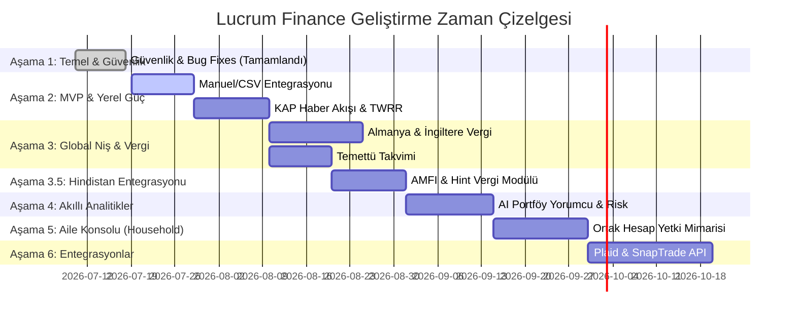

# Lucrum Finance - Stratejik Ürün Yol Haritası ve Pazar Analiz Raporu

Bu belge, kod tabanındaki teknik denetim bulgularımız ile Gemini Deep Search'ün pazar araştırmasından elde ettiği bulguları bir araya getirerek Lucrum Finance'in ürün geliştirme ve küresel yayılma stratejisini çizmektedir.

---

## BÖLÜM 1: ÜRÜN VE GELİŞTİRME YOL HARİTASI (PRODUCT ROADMAP)

### 🚀 Aşama 1: Güvenlik Sertleştirme & Temel Düzeltmeler (Tamamlandı)
*Durum: FİİLEN TAMAMLANDI*  
Uluslararası pazara açılmadan önce veri sızıntılarını ve finansal hesaplama hatalarını sıfırlayan ~20'den fazla düzeltme başarıyla yayına alındı.

#### Tamamlanan Çalışmalar:
1. **DB Reset Güvenliği:** `/api/portfolio/reset` endpoint'i kimlik doğrulamaya bağlanarak kontrolsüz sıfırlama bypass'ı engellendi.
2. **Stateless JWT & Aktiflik Kontrolü:** `dependencies.py` içinde `is_active` kontrolü eklenerek askıya alınan hesapların oturum yetkileri anında iptal edildi.
3. **Geçmiş Kur Fallback Düzeltmesi:** 730 günden eski tarihlere ait kur veri eksikliği ve fallback hataları giderildi.
4. **Nakit Faiz Hesaplama Mantığı:** Lot-tracking yerine matematiksel olarak eşdeğer ve çok daha sade olan **ağırlıklı ortalama alım tarihi yöntemi** (top-up esnasında: `avg_days_held = (eski_miktar × eski_gün) / yeni_toplam`) başarıyla koda işlendi.
5. **GDPR Uyum (Right to Erasure - Madde 17):** KVKK ve GDPR gereksinimi olan hesap silme akışı (`DELETE /api/users/me` ve cascade delete ile tüm ilişkili verilerin temizlenmesi) sisteme eklendi.
6. **Güvenlik ve Test Güçlendirmesi:** Hız sınırlama (rate limiting), eşzamanlılık kilidi (concurrency lock), girdi doğrulamaları (input validation) eklendi; backend test kapsamı 34'ten 59'a çıkarıldı ve frontend test altyapısı sıfırdan kuruldu.

---

### 📦 Aşama 2: Yerel Güç & "Privacy-First" Manuel İthalat (2-3. Hafta)
*Öncelik: Yüksek*  
Kullanıcılara aracı kurum şifrelerini girmeden (Zero-Knowledge / Güvenli) veri aktarma kolaylığı sunmak ve BIST/TEFAS entegrasyonunu tamamlamak.

#### Eklenecek Özellikler:
1. **Esnek CSV/Excel İçe Aktarıcı (Statement Parser):** getquin ve Delta'nın zayıf olduğu manuel veri aktarımını çözmek için, popüler brokerların (Midas, Garanti, İş Bankası, Interactive Brokers vb.) CSV/Excel ekstrelerini otomatik tanıyan modül.
2. **KAP Bildirimlerinin Smart News Feed Entegrasyonu:** Kullanıcının portföyündeki BIST hisselerine ve TEFAS fonlarına özel KAP haberlerini anlık olarak dashboard'a yansıtma.
3. **Çoklu Para Birimi & Kur Etkisi (FX vs Price Effect):** Portföydeki döviz bazlı kazançları "kur artışı getirisi" ve "varlık fiyatı artışı getirisi" olarak ikiye ayıran grafik panel.
4. **Arjantin Paralel Kur Desteği:** Resmi kurun yanı sıra paralel kur (Blue Dollar) takibi için entegrasyon.

#### Kod Haritalaması:
*   **Alternative Currency Provider (Latin Amerika):** Arjantin paralel piyasa (Blue Dollar) kurları için **Bluelytics API** entegrasyonu yazılacak.
*   **Backend Database Schema:** `DBTransaction` tablosuna `fx_rate_at_transaction` ve `broker_source` kolonları eklenecek [db_models.py](file:///c:/Users/ohham/lucrum-finance-mcp/backend/db_models.py#L99).
*   **Backend Services:** `services.py` içinde `calculate_portfolio` fonksiyonuna kur etkisi ayrıştırma matematiği eklenecek [services.py:L691](file:///c:/Users/ohham/lucrum-finance-mcp/backend/services.py#L691).
*   **Frontend UI:** `App.tsx` ve holdings tablolarına "Kur Etkisi" ve "Fiyat Etkisi" kolonları yerleştirilecek.

---

### 🇪🇺 Aşama 3: Global Niş & Vergi Hesaplamaları (4-5. Hafta)
*Öncelik: Orta - Yüksek*  
Almanya ve İngiltere pazarlarındaki en büyük "para ödeme" motivasyonu olan vergilendirmeyi çözmek.

#### Eklenecek Özellikler:
1. **Almanya Vergi Modülü:**
   * Kripto paralar için FIFO bazlı 1 yıllık yaş takibi (1 yıldan eski olanları "Vergiden Muaf" etiketleme).
   * Biriken (accumulating) ETF'ler için otomatik *Vorabpauschale* (avans vergisi) hesaplayıcı.
2. **Birleşik Krallık (UK) Vergi Modülü:**
   * Stocks & Shares ISA (20.000 £ limit) ve SIPP emeklilik hesaplarının yasal limit takipleri.
   * Genel yatırım hesaplarından ISA'ya geçiş analizi (*Bed-and-ISA*).
3. **Finansal Takvim (genişletilmiş — eskiden sadece "Temettü Takvimi"):**
   * Tek bir takvim ekranında: **temettü tarihleri**, **bilanço/kazanç tarihleri** (portföydeki hisseler için), **ülke enflasyon veri açıklanma tarihleri** ve **vergi dönemi/son tarihleri** — hepsi TAHMİNİ DEĞİL, gerçek resmi kaynaktan. Kullanıcı "bugün AAPL temettü, Türkiye enflasyon verisi, UK vergi yılı başlangıcı" gibi karma bir günü tek ekranda görür.
   * **KAPSAM İLKESİ (kullanıcı talebi):** Hiçbir tarih tahmin/yaklaşık olarak gösterilmeyecek — bir ülke için gerçek zamanlı/resmi kaynak doğrulanamadıysa o ülkenin verisi takvimde YOK sayılır, uydurulmaz.
4. **Hukuki Yasal Sorumluluk Reddi (Legal Disclaimer) Entegrasyonu:**
   * **KRİTİK HUKUKİ GEREKSİNİM:** Almanya'da *Vorabpauschale* gibi kesin vergi estimates üreten sistemler "Steuerberater" (yeminli mali müşavir) yasalarıyla çelişebilir. Bu nedenle `TaxDashboard.tsx` üzerinde Sharesight'ta olduğu gibi *"Bu araç bilgilendirme amaçlıdır, kesinlikle profesyonel vergi tavsiyesi niteliği taşımaz"* ibaresi yasal olarak zorunlu kılınacaktır.

#### Kod Haritalaması:
*   **Backend Database:** `DBPosition` tablosuna `tax_wrapper` (GIA, ISA, SIPP vb.) alanı eklenecek [db_models.py:L66](file:///c:/Users/ohham/lucrum-finance-mcp/backend/db_models.py#L66).
*   **Backend Services:** [services.py](file:///c:/Users/ohham/lucrum-finance-mcp/backend/services.py) içerisine `calculate_germany_taxes` ve `calculate_uk_taxes` adında iki yeni yardımcı servis eklenecek.
*   **Frontend UI:** `TaxDashboard.tsx` ve `FinancialCalendar.tsx` bileşenleri geliştirilecek; yasal sorumluluk reddi metinleri panellere eklenecek.

#### Finansal Takvim — Ülke Bazlı Kaynak Araştırması (Chrome ile canlı doğrulandı, 2026-07-19):

| Ülke | Kaynak | Format | Doğrulama |
|---|---|---|---|
| 🇹🇷 Türkiye | TÜİK `GetYillikHaberBulteniListesi?yil=YYYY` (`www.tuik.gov.tr/Kurumsal/GetYillikHaberBulteniListesi`) | **JSON, anahtarsız** | Canlı çekildi: 2026 için 2.219 kayıt. Örnek: `{"sorumluKisaAd":"TÜİK","adi":"Tüketici Fiyat Endeksi (TÜFE)","gTarih":"2026-07-03T10:00:00","donemi":"Haziran 2026"}`. **Bonus:** aynı feed TCMB (faiz oranları, kur), SPK, BDDK gibi diğer tüm kamu kurumlarının verilerini de içeriyor — tek kaynaktan çoklu takvim verisi. |
| 🇩🇪 Almanya | Destatis `Wochenvorschau` (`destatis.de/DE/Presse/Wochenvorschau/_inhalt.html`) | Düz HTML tablo, JS yok | Canlı görüldü: her Cuma 10:00 CET güncellenen, bir sonraki haftanın TÜM yayınlarını (tarih + EVAS kodu + konu) listeleyen tablo. Sadece 1 hafta ileriye bakıyor — haftalık kazınmalı. |
| 🇬🇧 İngiltere | ONS `ons.gov.uk/releasecalendar` | RSS, anahtarsız | Akış çalışıyor, "Yaklaşan" filtresi mevcut; sunucu tarafı konu filtresi yok, başlık eşlemesiyle (örn. "Consumer price inflation") istemci tarafında filtrelenmeli. |
| 🇮🇳 Hindistan | MOSPI `mospi.gov.in/api/release-calender/fetch-all-release-calender-Web` | **JSON API** (sayfa arkasında) | Tarayıcıda canlı görüldü: "2026 - July 13 — All India Consumer Price Index (CPI)". İstek gövdesi (ay/yıl parametreleri) uygulama aşamasında devtools ile netleştirilmeli. |
| 🇦🇷 Arjantin | INDEC `calendario_1sem2026.pdf` / `calendario_2sem2026.pdf` (`indec.gob.ar/ftp/cuadros/publicaciones/`) | PDF (6 aylık) | Arama ile doğrulandı — tarihler yasayla 12 ay önceden ilan ediliyor (siyasi müdahaleye karşı koruma), format PDF tablo parse gerektiriyor. |

**Kapsam ilkesi:** Yukarıdaki 5 kaynağın hiçbiri tahmini değil — hepsi ilgili ülkenin resmi istatistik kurumunun kendi yayınladığı takvim. Format karışık (2 JSON API, 1 HTML tablo, 1 RSS, 1 PDF) ama hepsi gerçek. Gelecekte yeni bir ülke eklenirken de aynı ilke geçerli: resmi, doğrulanabilir kaynak yoksa o ülke takvime eklenmez.

---

### 🇮🇳 Aşama 3.5: Hindistan Pazarı (India) Entegrasyonları (5-6. Hafta)
*Öncelik: Yüksek (Gelişmekte Olan İkinci Majör Pazar)*  
*Gerekçe: ABD pazarındaki aşırı doymuş rekabet, yüksek CAC ve SEC/FINRA'nın "AI Portföy Yorumcularına" yönelik kayıtsız yatırım tavsiyesi riskleri nedeniyle ABD hedef pazarlardan tamamen çıkarılmış; bunun yerine Hindistan pazarı eklenmiştir.*

#### Eklenecek Özellikler:
1. **AMFI Yatırım Fonu (Mutual Funds) Entegrasyonu:** Hindistan'daki tüm yatırım fonlarının günlük NAV (Net Asset Value) verilerini resmi **AMFI (Association of Mutual Funds in India)** kaynağından ücretsiz otomatik çekme (kod tabanımızdaki TEFAS/Fonoloji deseniyle aynı mimaride kurulacaktır).
   * **DOĞRULANDI (canlı test edildi):** AMFI'nin ham `NAVAll.txt` dosyasına bu ortamdan erişim `ECONNREFUSED` ile başarısız oldu (coğrafi kısıtlama olabilir — VPN'siz doğrulanamadı). Bunun yerine **mfapi.in** — AMFI verisini saran, ücretsiz, anahtarsız bir topluluk REST API'si — canlı test edildi ve çalışıyor: `GET https://api.mfapi.in/mf` (37.670 fonun tam kod+isim listesi) ve `GET https://api.mfapi.in/mf/{scheme_code}` (fon evi/ISIN/kategori metadata'sı + günlük tarihsel NAV serisi, tek istekte JSON). Fonoloji'nin pytefas'a göre HTML kazımak yerine temiz JSON vermesiyle birebir aynı avantajı sağlıyor — birincil teknik kaynak bu olmalı, ham AMFI dosyası yalnızca yedek/doğrulama amaçlı değerlendirilebilir.
2. **Hindistan Vergi Modülü:**
   * LTCG (Long-Term Capital Gains) ve STCG (Short-Term Capital Gains) sermaye kazancı vergi hesaplayıcısı.
   * ELSS (Equity Linked Savings Scheme) fonlarının Section 80C kapsamındaki vergi muafiyeti limit takipleri.
3. **LRS (Liberalised Remittance Scheme) & Küresel Varlık Birleştirme:** Hint yatırımcıların LRS aracılığıyla tuttuğu yabancı/ABD hisseleri ile yerel NSE/BSE hisselerini ve kriptoları tek panelde TWRR/kur ayrıştırmasıyla birleştirme.
4. **Hukuki Uyarı:** SEBI (Securities and Exchange Board of India) kurallarına uygun yasal sorumluluk reddi ibaresinin eklenmesi.

#### Kod Haritalaması:
*   **Alternative Data Provider (Hindistan):** `twelve_data.py`'deki Fonoloji istemcisiyle aynı desende, **mfapi.in** için basit bir REST istemcisi yazılacak (auth gerekmiyor).
*   **Backend Services:** [services.py](file:///c:/Users/ohham/lucrum-finance-mcp/backend/services.py) içerisine mfapi.in'den fon verisi çeken bir istemci ve `calculate_india_taxes` yardımcı servisi yazılacak.
*   **Frontend UI:** `TaxDashboard.tsx` bileşenine Hindistan vergi kuralları (LTCG/STCG) tablosu ve SIP birikim takip arayüzü eklenecek.

---

### 🧠 Aşama 4: Akıllı Analitikler & Risk Yönetimi (6-7. Hafta)
*Öncelik: Orta*  
Platformu basit bir takipçiden "Akıllı Finansal Danışmana" dönüştürmek.

#### Eklenecek Özellikler:
1. **Korelasyon Matrisi & Çeşitlendirme Skoru:** Portföydeki varlıkların birbirleriyle ilişkisini gösteren renk kodlu korelasyon ısı haritası ve portföy riskini azaltıcı çeşitlendirme önerileri.
2. **AI Portföy Yorumlayıcısı (AI Insights):** Kullanıcının varlık dağılımını analiz ederek konsantrasyon riskini raporlayan **gerçek LLM entegrasyonu**.
   * *Not: SEC/FINRA yasal riskleri nedeniyle, AI yorumcu özellikleri kesinlikle kişiselleştirilmiş "sat/al" gibi yatırım tavsiyeleri vermeyecek; sadece genel modern portföy teorisi çerçevesinde risk ve çeşitlendirme analizleri sunacaktır.*
3. **Rebalans Sapma Uyarı Bildirimleri:** Portföy hedef dağılımdan saptığında Celery/Redis aracılığıyla arka planda haftalık e-posta ve anlık bildirim gönderme.

#### Kod Haritalaması:
*   **AI Engine Entegrasyonu:** `package.json` dosyasında hazır bulunan ve şu an kullanılmayan `@google/genai` kütüphanesi aktif edilerek gerçek Gemini LLM entegrasyonu kurulacak (statik Mock analitikler kaldırılacak).
*   **Backend Routers/Services:** `portfolio.py` içine `/api/portfolio/correlation` endpoint'i eklenecek, korelasyon hesabı için `pandas` ve `numpy` entegre edilecek [portfolio.py:L98](file:///c:/Users/ohham/lucrum-finance-mcp/backend/routers/portfolio.py#L98).
*   **Celery Tasks:** `tasks.py` içerisine her Pazartesi sabahı çalışacak `send_weekly_portfolio_summary_task` eklenecek [tasks.py:L17](file:///c:/Users/ohham/lucrum-finance-mcp/backend/tasks.py#L17).
*   **Frontend UI:** Rebalans ayarları paneli ve interaktif Korelasyon Isı Haritası bileşenleri geliştirilecek.

---

### 👥 Aşama 5: Aile Konsolu / Ortak Hesap Yetkilendirme Mimarisi (8. Hafta)
*Öncelik: Yüksek (Mimarisi Ağır)*  
*Not: Tek satırlık bir özellik olmaktan çıkarılarak, auth/billing/database seviyesinde kapsamlı bir alt faza dönüştürülmüştür.*

#### Eklenecek Özellikler:
Mevcut veritabanı şeması her tabloda `user_id` yabancı anahtarı ile (Single-Tenant) çalışmaktadır. Eşlerin veya çocukların yatırımlarını konsolide takip edebilmek için:
1. **Çoklu Yetkilendirme (Multi-User Permissions):** Kullanıcının, kendi portföyünü başka bir kullanıcıya "Sadece Okuma" (Read-Only) veya "Düzenleme" (Editor) yetkisiyle açabilmesi.
2. **Alt Hesap (Sub-Account) Mimarisi:** Ana hesaba bağlı sanal alt hesaplar oluşturma ve bunları konsolide veya filtreli raporlama.
3. **Billing ve Ortak Abonelik Yapısı:** Aile paketlerinin (Family Plan) Lemon Squeezy abonelikleri ile yetkilendirme katmanında eşleştirilmesi.

#### Kod Haritalaması:
*   **Backend Database Schema:** `DBUser` tablosuna `parent_user_id` eklenecek. Portföy paylaşım izinlerini tutmak için `DBPortfolioShare` adında yeni bir ilişki tablosu oluşturulacak.
*   **Backend Authentication Middleware:** Tüm endpoint'lerde `get_current_user_id` üzerinden gelen ID'nin, erişilmek istenen `position` / `transaction` kayıtlarının `user_id` alanı ile sahibi olup olmadığı veya paylaşım izninin bulunup bulunmadığı yetki kontrolüne (RBAC - Role Based Access Control) tabi tutulacak.

---

### 🔌 Aşama 6: Entegrasyonlar & Maliyet Ölçeklenmesi (9. Hafta ve Sonrası)
*Öncelik: Düşük - Orta (Ücretli Paket Kilidi)*

#### Eklenecek Özellikler:
1. **Plaid & SnapTrade API Entegrasyonu:** Avrupa bankalarındaki hisse/nakit bakiyelerini otomatik eşleme.
   * **KAPSAM UYARISI:** Plaid ve SnapTrade Hindistan'ı desteklemez (yalnızca ABD/Avrupa/Kanada). Hindistan'da otomatik banka/aracı kurum senkronizasyonu için RBI'ın zorunlu kıldığı **Account Aggregator (AA)** çerçevesi üzerinden çalışan ayrı bir sağlayıcı (Setu, Finvu veya Perfios) entegre edilmelidir — bu, Plaid/SnapTrade işiyle aynı fazda değil, Hindistan'a özel ayrı bir alt görev olarak planlanmalı.
2. **Yapay Zeka Destekli Ekstre Okuyucu (AI PDF/CSV Parser):** Desteklenmeyen yerel brokerların PDF hesap özetlerini yükleyerek işlem geçmişini çıkarma.
3. **Maliyet Ölçeklenmesi Planlaması:**
   * **BİLGİ:** Twelve Data ücretli aboneliğimiz aktif olduğundan dolayı veri kotaları veya istek limitleri (rate-limiting) bir darboğaz oluşturmamaktadır. Ancak Plaid/SnapTrade gibi kullanıcı başına değişken maliyet oluşturan üçüncü taraf banka entegrasyonlarının maliyet yönetimi LTD paketlerinde yine de sınırlandırılmalıdır.

---

## BÖLÜM 2: GEMINI DEEP SEARCH KÜRESEL PAZAR ARAŞTIRMA RAPORU

### 1. Olmazsa Olmaz Özellikler ve Ürün Geliştirme Trendleri
Bireysel yatırımcıların portföy takip araçlarından beklentileri, basit varlık gösteriminin ötesine geçerek derin finansal analiz, vergi planlaması ve aktif risk yönetimi alanlarına kaymıştır. Bu pazar dinamiklerinde, kullanıcıların her gün uygulamaya geri dönmesini sağlayan tutundurma (retention) mekanizmaları, ödeme duvarını (paywall) aşmaya ikna eden kritik çözümler ve ürünü pazarda konumlandıran fark yaratıcı (moat) unsurlar stratejik olarak incelenmiştir.

#### Kullanıcı Tutundurma (Retention) Sağlayan Dinamik Mekanizmalar
Yatırımcıların uygulamayı günlük veya haftalık olarak düzenli açmalarını sağlayan en güçlü unsurların başında, geleceğe yönelik nakit akışlarını görselleştiren temettü takvimleri gelmektedir. Gelecekteki temettü ödemelerini tarih, miktar, büyüme oranı ve verim bazında listeleyen takvimler, özellikle pasif gelir odaklı yatırımcılar için güçlü bir psikolojik ödül mekanizması sunmaktadır. Bu bağlamda, temettü büyüme hızı (Dividend Growth Rate) gibi ileri düzey metriklerin takvime entegre edilmesi, kullanıcıların yatırım kararlarını test etmelerini sağlamaktadır.

Ayrıca, portföyün hedef varlık dağılımından sapmasını (rebalancing deviation) izleyen ve önceden belirlenen tolerans eşikleri aşıldığında kullanıcıyı uyaran akıllı fiyat alarmları ve anlık bildirimler (push notifications), kullanıcıyı platforma geri çeken operasyonel tetikleyicilerdir. Haftalık portföy özet e-postaları ise pasif takipçiler için kayıp oranını (churn rate) ciddi ölçüde düşüren bir diğer unsurdur. Enflasyon, faiz kararları, döviz şokları gibi makroekonomik gelişmelerin portföyün reel değeri üzerindeki etkilerini simüle eden senaryo analizleri de yatırımcıların piyasa dalgalanmalarında uygulamayı bir sığınak olarak kullanmasını sağlamaktadır.

#### Ödeme Duvarını (Paywall) Aşmaya Teşvik Eden Kritik Çözümler
Kullanıcıların ücretsiz sürümden ücretli (Premium) paketlere geçiş yapmasındaki en büyük motivasyon kaynağı, operasyonel yükü sıfırlayan otomatik aracı kurum ve banka entegrasyonlarıdır. Kullanıcılar her işlemi manuel girmek yerine, Plaid, SnapTrade, Flanks veya Salt Edge gibi açık bankacılık ve veri entegratörleri üzerinden hesaplarını bağlayarak işlemlerin otomatik senkronize olmasını talep etmektedir. Entegrasyon desteği olmayan yerel brokerlar için PDF hesap ekstresi veya ekran görüntüsü üzerinden işlem geçmişini yapay zeka ile okuyan akıllı içe aktarım (smart CSV/PDF parser) araçları ödeme duvarının arkasına başarıyla konumlandırılmaktadır.

Ücretli paketlerin en büyük dönemsel satış kaldıracı ise ülkeye özgü detaylı yıllık vergi ve sermaye kazancı (capital gains) raporlamasıdır. Özellikle Avustralya, Almanya, Birleşik Krallık gibi ülkelerde karmaşık maliyet temeli (cost basis) hesaplamaları ve FIFO/LIFO yöntemlerine göre vergi matrahı çıkaran modüller, abonelik ücretinin kullanıcı gözünde doğrudan bir maliyet tasarrufuna dönüşmesini sağlamaktadır.

#### Sektörde Rekabet Avantajı (Moat) Yaratan Farklılaştırıcı Unsurlar
Pazardaki standart çözümlerin önüne geçmek ve güçlü bir rekabet avantajı (moat) yaratmak için yapay zeka destekli portföy yorumlayıcıları öne çıkmaktadır. Bu sistemler, kullanıcının varlık dağılımını analiz ederek konsantrasyon risklerini (overexposure) tespit etmekte ve kullanıcılara sade bir dille açıklayıcı raporlar sunmaktadır.

Ayrıca, portföydeki varlıkların birbiriyle olan korelasyon matrisini çıkararak risk azaltıcı çeşitlendirme önerileri sunan, modern portföy teorisine dayalı Efficient Frontier (Etkin Sınır) optimizasyon araçları ve Value at Risk (VaR) analizleri finansal okuryazarlığı yüksek kitleyi hedeflemektedir. Son olarak, aile portföyü veya ortak hesap yönetimi (household console), eşlerin veya çocukların yatırımlarını tek bir çatı altında ama farklı alt hesaplarda konsolide takip etmesini sağlayarak ürünün hanehalkı düzeyinde kalıcı olmasını kolaylaştırmaktadır.

---

### 2. Küresel ve Yerel Rakip Analizi
Portföy takip yazılımları pazarı, veri gizliliğine odaklanan niş ürünlerden geniş sosyal topluluklar barındıran platformlara kadar geniş bir yelpazeye yayılmıştır. Küresel ölçekte Sharesight, getquin, Delta (by eToro), Kubera, Navexa ve Copilot Money sektörü domine ederken; Türkiye pazarında Portfoy App (The Portfoy), Servet, Fonum ve Fintables öne çıkan yerel oyunculardır.

#### Getiri Metodolojileri ve Matematiksel Altyapı
Portföy performans hesaplamalarında zaman ağırlıklı getiri (TWRR) ve para ağırlıklı getiri (MWRR) arasındaki matematiksel ayrım, Lucrum Finance’in küresel rekabetteki en büyük teknik kozlarından biridir.

Zaman Ağırlıklı Getiri Oranı (TWRR), nakit giriş ve çıkışlarının zamanlamasından bağımsız olarak, portföy yöneticisinin veya seçilen varlıkların saf performansını ölçmektedir. Portföyün nakit akışı gerçekleşen her alt dönemi için getiri oranları hesaplanır ve geometrik olarak birleştirilir:
$$TWRR = \left[ \prod_{i=1}^{n} (1 + R_i) \right] - 1$$

Burada $R_i$, her bir alt dönemin getirisini temsil etmektedir:
$$R_i = \frac{EV_i - (BV_i + CF_i)}{BV_i + CF_i}$$
($EV_i$: Dönem Sonu Değeri, $BV_i$: Dönem Başı Değeri, $CF_i$: Döneme Ait Net Nakit Akışı).

Para Ağırlıklı Getiri Oranı (MWRR - İç Verim Oranı / IRR), yatırımcının portföye yaptığı nakit girişlerinin zamanlamasının ve boyutunun nihai getiri üzerindeki etkisini ölçmektedir. Portföye eklenen veya portföyden çekilen her nakit akışını ($CF_t$) iskonto ederek başlangıç değerine eşitleyen $r$ oranını bulmayı hedeflemektedir:
$$PV = \sum_{t=0}^{N} \frac{CF_t}{(1+r)^t}$$

Piyasadaki getquin gibi sosyal odaklı araçlar veya Kubera gibi bakiye odaklı sistemler genellikle yalnızca MWRR hesaplarken, Sharesight ve Navexa gibi profesyonel araçlar her ikisini birden sunarak kullanıcılara yatırım kararlarının zamanlama başarısını analiz etme imkanı tanımaktadır.

#### Kur Etkisi (FX Effect) ve Fiyat Etkisi (Price Effect) Ayrımı
Küresel çapta yatırım yapan bireysel yatırımcılar için en büyük finansal yanılsama kur kazançlarıdır. Gelişmiş platformlar bu sorunu kur etkisi (FX Effect) ve fiyat etkisi (Price Effect) ayrımı yaparak çözmektedir. Bu ayrım şu şekilde formüle edilmektedir:
- **Toplam Getiri (Base Currency):** Yatırımın güncel değerinin ve geçmiş nakit akışlarının, gerçekleştikleri tarihteki spot döviz kuru üzerinden raporlama para birimine çevrilmesiyle hesaplanır.
- **Sermaye Getirisi (Capital Return):** Güncel ve geçmiş tüm nakit akışlarının, pozisyonun ilk açıldığı tarihteki (veya dönemin ilk günündeki) sabit döviz kuru üzerinden çevrilerek hesaplanmasıyla elde edilir.
- **Kur Getirisi (Currency Return):** Toplam Getiri değerinden Sermaye Getirisi çıkarılarak izole edilir:
$$\text{Currency Return} = \text{Total Return (at Current FX)} - \text{Capital Return (at Historical FX)}$$

Lucrum Finance'in döviz çevrimlerini geçmiş tarihli alım pariteleriyle yapabilmesi, bu kur etkisini milimetrik düzeyde ayrıştırabilmesini sağlayarak onu Sharesight ve Navexa seviyesinde konumlandırmaktadır.

#### Entegrasyon Modelleri ve Güvenlik Sınırları
Otomatik veri çekme süreçlerinde entegrasyon altyapıları farklılaşmaktadır. getquin, Flanks, Plaid ve Yodlee gibi API entegratörlerini kullanırken; Kubera, Plaid, Yodlee, MX, SnapTrade ve Salt Edge dahil olmak üzere 9 farklı sağlayıcıyla entegre çalışmaktadır. Copilot Money ise Plaid odaklı bir banka eşitleme modeli sunmaktadır. Sharesight, doğrudan banka entegrasyonu sunmamakta, bunun yerine aracı kurumlardan gelen işlem onay e-postalarının (contract notes) otomatik okunması ve manuel içe aktarıma odaklanmaktadır. Türkiye pazarındaki Portfoy App, Servet ve Fonum ise tamamen manuel veri girişine veya kısıtlı yerel veri setlerine dayanmaktadır.

#### Rakiplerin Kullanıcı Şikayetleri ve Teknik Açmazlar
Rakiplerin kullanıcı topluluklarındaki (Reddit, Trustpilot, vb.) en büyük şikayet konuları incelendiğinde, teknik esnekliklerin ve veri senkronizasyonlarının yetersizliği göze çarpmaktadır:
- **Sharesight Kullanıcı Memnuniyetsizlikleri:** Kullanıcılar, son arayüz güncellemelerinde tarih aralığı veya filtre değişiminden sonra sürekli "Apply" butonuna tıklama zorunluluğu getirilmesi gibi gereksiz mikro etkileşimlerden şikayetçidir. Ayrıca, yıllık $270'ı aşan abonelik ücretleri, pasif ve küçük yatırımcılar için fahiş bulunmaktadır. Platformda opsiyon sözleşmelerinin ve türev ürünlerin takip edilememesi de önemli bir eksiklik olarak vurgulanmaktadır.
- **getquin Güvenlik ve Bağlantı Krizleri:** getquin kullanıcıları, aracı kurum entegrasyonu sağlayan üçüncü taraf Flanks altyapısının şifre ve iki aşamalı doğrulama (2FA) kodlarını talep etmesini güvensiz bulmaktadır. Ayrıca Flanks sunucularındaki yönlendirme hataları nedeniyle, kullanıcıların hesaplarına İspanya veya İsrail (Tel Aviv Google sunucuları) üzerinden şüpheli girişler yapıldığına dair broker uyarıları tetiklenmiş ve bu durum toplulukta ciddi bir güven krizine yol açmıştır. Platformda işlevsel bir CSV/Excel dışa/içe aktarım mekanizmasının olmaması da manuel müdahaleleri zorlaştırmaktadır.
- **Copilot Money Bütçe Senkronizasyon Hataları:** Copilot Money’nin birikim hedefleri (savings goals) ve harcama grafikleri, vadesiz hesaplar ile yatırım hesapları arasındaki transferlerde çift kayıt (double entry) hatası vermekte ve aylık bütçe grafiklerini bozmaktadır. Kullanıcıların otomatik kuralları kendi başlarına esnek bir şekilde düzenleyememesi ve her kural değişimi için destek ekibine yazmak zorunda kalması da operasyonel bir şikayet konusudur.

---

### 3. Hedef Ülkeler ve Coğrafi Fırsat Analizi

#### Almanya 🇩🇪: ETF Tasarruf Kültürü (Sparplan) ve Karmaşık Vergilendirme Sistemi
Almanya, 21 milyondan fazla bireysel yatırımcının düzenli fon ve ETF tasarruf planına (Sparplan) sahip olduğu, Avrupa’nın en disiplinli bireysel yatırım pazarıdır. Bu pazarda Trade Republic ve Scalable Capital gibi düşük komisyonlu mobil brokerlar yaygındır. Alman yatırımcıların bir portföy takip SaaS uygulamasından en büyük beklentisi vergi uyumluluğudur.
- **Abgeltungssteuer ve Sparerpauschbetrag:** Almanya’da sermaye kazançları %25 oranında düz vergiye (artı dayanışma vergisi - Soli ve kilise vergisiyle birlikte %26,375) tabidir. Ancak her bireyin yıllık 1.000 € (evli çiftler için 2.000 €) tutarında vergi muafiyeti (Sparerpauschbetrag) bulunur. Portföy takip araçları, bu muafiyet sınırının ne kadarının kullanıldığını gerçek zamanlı izlemek zorundadır.
- **Vorabpauschale (Peşin Vergilendirme Ödemesi):** Özellikle biriken (accumulating) ETF'ler için her yılın Ocak ayında kesilen bu karmaşık avans vergisi, yatırımcılar için ciddi bir hesaplama yüküdür. Vorabpauschale; portföy değeri, o yılki taban faiz oranı (Basiszins), kısmi muafiyet oranları (Teilfreistellung - hisse senedi fonları için %30 indirim) dikkate alınarak hesaplanır:
$$\text{Vorabpauschale} = \min\left(\text{Değer Artışı}, \text{Portföy Değeri} \times \text{Basiszins} \times 0.7\right)$$
Vergisi ise:
$$\text{Ödenecek Vergi} = \text{Vorabpauschale} \times (1 - \text{Teilfreistellung}) \times \text{Abgeltungssteuer}$$
- **Kripto Para Vergi Avantajı:** Almanya’da kripto paralar diğer varlık sınıflarından farklı olarak "özel elden çıkarma işlemi" (private disposal) kapsamında vergilendirilir. Eğer bir kripto varlık satın alındıktan sonra 1 yıldan fazla elde tutulursa, satıştan elde edilen kâr tamamen vergiden muaftır. 1 yıldan kısa süreli satışlarda ise yıllık 1.000 € spekülasyon sınırı (Freigrenze) bulunur. Bu durum, portföy takip aracında FIFO (First-In, First-Out) metodolojisiyle çalışan, her bir alım lotunun yaşını (holding period) takip eden vergi optimizasyonu özelliğini "olmazsa olmaz" kılmaktadır.

#### Arjantin 🇦🇷 ve Brezilya 🇧🇷: Hiperenflasyonist Ortamda Reel Değer Takibi ve Dollarization
Güney Amerika pazarları, kronik yüksek enflasyon, devalüasyonlar ve katı sermaye kontrolleriyle karakterize edilir. Arjantin Peso'sunun (ARS) resmi kur ile paralel piyasa (Blue Dollar) kuru arasındaki makaslar ve sürekli uygulanan devalüasyonlar, yerel halkı birer finansal hayatta kalma uzmanına dönüştürmüştür.
- **Varlık Dağılım Trendleri:** Arjantin ve Brezilya'daki bireysel yatırımcılar varlıklarını yerel para biriminde tutmazlar. Portföyler; fiziksel ABD Doları, stablecoin'ler (USDT, USDC), kripto paralar, altın ve ABD borsalarında işlem gören hisse senetlerinin yerel sertifikalarından (Arjantin’de CEDEAR'lar) oluşur.
- **Reel Değer Takibi (USD Mercekli Analiz):** Bu coğrafyadaki yatırımcılar için portföyün yerel para birimindeki nominal artışı hiçbir anlam ifade etmez; zira %100'ü aşan enflasyon bu kârı tamamen eritir. Bu nedenle, portföyün "dolar bazlı gerçek değeri" (hard currency representation) ve enflasyondan arındırılmış reel getirisi yaşamsal önemdedir. Lucrum Finance, bu bölgelerdeki yatırımcılara tüm alternatif varlıkları (stablecoin, nakit USD, kripto, küresel hisseler) tek bir portföyde birleştirip anında ABD Doları bazlı performans raporu sunarak benzersiz bir değer önermesi yaratabilir. Arjantin paralel kur (Blue Dollar) takibi için **Bluelytics API** kullanılacaktır.

#### Birleşik Krallık 🇬🇧: Vergi Avantajlı Emeklilik ve Yatırım Hesaplarının (ISA & SIPP) Yönetimi
Birleşik Krallık bireysel yatırımcı pazarı, devlet tarafından teşvik edilen vergi avantajlı hesap türleri (wrappers) etrafında şekillenmiştir. Yatırımcılar yatırımlarını genellikle iki ana hesap üzerinden yönetir:
- **Stocks & Shares ISA (Bireysel Tasarruf Hesabı):** Bireylerin her mali yılda 20.000 £'e kadar vergi ödemeden yatırım yapabildiği, hesap içindeki sermaye kazançlarının ve temettülerin ömür boyu tamamen vergiden muaf olduğu hesap türüdür.
- **SIPP (Kendi Kendine Yönetilen Kişisel Emeklilik):** Yatırımcının gelir vergisi dilimine göre devletten %20 ila %45 arasında vergi iadesi (tax relief) aldığı, ancak paranın 57 yaşına kadar kilitli kaldığı emeklilik hesabıdır.
- **"Bed-and-ISA" Operasyonu ve Takibi:** Yatırımcıların vergi sınırını aşan genel yatırım hesaplarındaki (GIA) varlıklarını satıp, aynı gün içinde bu varlıkları vergi korumalı Stocks & Shares ISA hesabına aktarması işlemidir. Bir portföy takip aracı, bu geçişin yaratacağı anlık sermaye kazancı vergisi (CGT) yükünü hesaplayabilmeli ve gelecekteki vergi tasarrufunun başabaş (break-even) analizini sunmalıdır. SIPP ve ISA hesaplarındaki farklı vergi rejimlerini tek bir konsolide ekranda ama yasal etiketleriyle takip edebilmek İngiliz yatırımcılar için birincil önceliktir.

#### Türkiye 🇹🇷: TEFAS ve BIST Entegrasyonlu Yeni Nesil Portföy Takip Potansiyeli
Türkiye, son yıllarda enflasyona karşı birikimlerini korumak isteyen milyonlarca yeni bireysel yatırımcının Borsa İstanbul'a (BIST) ve TEFAS yatırım fonlarına hücum ettiği dinamik bir pazardır.
- **TEFAS Yatırım Fonlarının Popülerliği:** Katılım fonları, değişken fonlar, yabancı teknoloji fonları ve serbest fonlar gibi yüzlerce alternatif, Türk yatırımcıların portföylerinde ağırlıklı yer tutmaktadır. Ancak bankaların mobil uygulamaları, bu fonların performansını kurumlar arası konsolide edememekte ve yalnızca kurum içi portföy değerini göstermektedir.
- **Metrik Eksikliği:** Yerel pazardaki Portfoy App veya Fonum gibi araçlar basit bakiye takibinin ötesine geçememekte; TWRR, portföy Betası, Sharpe oranı gibi kurumsal standartlardaki metrikleri sunamamaktadır.
- **Lucrum Finance’in Yerel Fırsat Alanı:** TEFAS yatırım fonlarının varlık dağılımlarını arka planda otomatik güncelleyen, BIST hisse senetleri ve kripto varlıklarla harmanlayıp TWRR hesaplayan web tabanlı profesyonel bir kontrol paneli, Türkiye’deki nitelikli bireysel yatırımcılar için pazarda alternatifsiz bir konum yaratacaktır. Ayrıca, holding bazlı KAP haber akışının doğrudan portföy paneline entegre edilmesi, yerel yatırımcının bilgiye ulaşma hızını radikal ölçüde artıracaktır.

#### Hindistan 🇮🇳: Büyüyen SIP / Yatırım Fonu Pazarı ve LRS ile Küresel Varlık Entegrasyonu
Hindistan, komisyonsuz dijital brokerlar (Zerodha, Groww) sayesinde milyonlarca yeni genç yatırımcının yerel borsalara ve fonlara girdiği devasa bir pazardır.
- **AMFI Entegrasyonu ve SIP Kültürü:** Bireysel yatırımcıların en büyük birikim aracı, her ay yatırım fonlarına (Mutual Funds) düzenli para aktarılan SIP (Systematic Investment Plan) modelidir. Hindistan'daki tüm yatırım fonlarının NAV (Net Asset Value) fiyat verileri, resmi **AMFI (Association of Mutual Funds in India)** veri akışı üzerinden ücretsiz yayınlanmaktadır. Bu sayede TEFAS entegrasyonu modelimiz Hindistan fonları için birebir kopyalanabilmektedir.
- **Karmaşık Sermaye Kazançları Vergisi (LTCG / STCG):** Hindistan'da hisse senedi ve fon kazançları Kısa Vadeli (STCG) ve Uzun Vadeli (LTCG) olarak farklı oranlarda vergilendirilir. Ayrıca ELSS (Equity Linked Savings Schemes) fonları Section 80C altında vergi indirimi sağlar. Bu vergi sınırlarının takibi ve raporlanması Hint kullanıcılar için yüksek katma değerli ücretli bir özelliktir.
- **LRS (Liberalised Remittance Scheme) ve Global Portföy Boşluğu:** Hint yatırımcılar LRS limiti kapsamında yerel hisse/fonların yanı sıra küresel/ABD hisselerini de portföylerinde tutarlar. Mevcut yerel araçlar bu varlıkları tek bir panelde yabancı hisse + yerel borsa + kripto paralarla konsolide edip, döviz bazlı reel getiri (TWRR) hesaplayamamaktadır. Lucrum Finance bu boşluğu mükemmel şekilde doldurabilir.
- **Fiyat Hassasiyeti ve PPP:** Pazarın fiyat hassasiyeti çok yüksek olduğundan, Hindistan IP'leri için %70 kalıcı yerel fiyatlandırma (PPP) indirimi zorunludur.

---

### 4. Fiyatlandırma ve Monetizasyon Stratejisi

#### Küresel Rakiplerin Fiyatlandırma Politikaları
- **Sharesight:** Aylık $9.33 - $31.00 USD, Yıllık $84.00 - $279.00 USD. Yerel para biriminde fatura keser ancak fiyat sabittir.
- **getquin:** Yıllık €49.99 - €89.99 EUR, Wealth paketi €149.99/yıl.
- **Kubera:** Essentials paketi Yıllık $199 - $250. PPP uygulanmıyor.
- **Navexa:** Yıllık $90 - $192 USD.
- **Delta Pro+:** Aylık $13.99, Yıllık $99.99. App Store/Google Play üzerinden yerel para biriminde ciddi indirimli tarifeler sunar.

#### Türkiye Pazarı İçin Yerel Fiyatlandırma (Localized Pricing for Turkey)
Türkiye'deki satın alma gücü paritesi (PPP) ve yerel rakiplerin fiyat bandı (99 ₺ - 299 ₺/ay) dikkate alınarak **Lucrum Finance Türkiye Fiyatlandırması** şu şekilde kurgulanmıştır:
- **Aylık Premium Plan:** **149 ₺ / Ay** (Global $9.99 planına göre ~%60 indirimli)
- **Yıllık Premium Plan:** **1.299 ₺ / Yıl** (Aylık ~108 ₺'ye denk gelir)
- **Ömür Boyu Tek Seferlik Erişim (LTD - Lansmana Özel):** **499 ₺** (Sadece ilk 100 kullanıcıya özel, otomatik Plaid entegrasyonu hariç)

Bu yerel fiyatlandırma Stripe ve Lemon Squeezy yerelleştirilmiş ödeme yöntemleri (TL desteği) üzerinden dinamik IP yönlendirmesiyle sunulacaktır.

#### Hindistan Pazarı İçin Yerel Fiyatlandırma (Localized Pricing for India)
Hindistan'ın yüksek fiyat hassasiyeti göz önüne alınarak kalıcı %70 PPP indirimi uygulanacaktır:
- **Aylık Premium Plan:** **249 ₹ (INR) / Ay** (Yaklaşık 3.00 USD)
- **Yıllık Premium Plan:** **1.999 ₹ (INR) / Yıl** (Yaklaşık 24.00 USD)
- **Ömür Boyu Tek Seferlik Erişim (LTD - Lansmana Özel):** **999 ₹ (INR)** (Yaklaşık 12.00 USD)

#### Ömür Boyu Tek Seferlik Ödeme (Lifetime Deal - LTD) Lansmanı ve Sürdürülebilirlik
Yeni bir finansal SaaS girişiminin pazara giriş aşamasında ilk 100-200 kullanıcısını kazanmak amacıyla Ömür Boyu Tek Seferlik Ödeme (LTD) sunması son derece popüler bir stratejidir.
- **Lucrum Finance LTD Yapılandırması:** Plaid, SnapTrade gibi kullanıcı başına değişken maliyet oluşturan üçüncü taraf banka entegrasyonları LTD paketinden hariç tutulacaktır (veya aylık ek mikro aboneliğe bağlanacaktır). Twelve Data kotalarımız ise ücretli aboneliğimiz sayesinde LTD kullanıcı hacmiyle birlikte bir maliyet darboğazı yaratmamaktadır.
- **Kademeli LTD Fiyatlaması:** Küresel pazarda ilk 100 kullanıcıya özel 49 $, sonraki 100 kullanıcıya özel 99 $ kademeli fiyatlandırma sunulacaktır.

---

### 5. İlk 100 Uluslararası Kullanıcıyı Kazanma ve Güven İnşası

#### Organik ve Topluluk Odaklı Büyüme (r/Finanzen, r/merval, r/UKPersonalFinance, r/SideProject)
- Reddit üzerinde doğrudan ürün reklamı yerine, toplulukların yaşadığı spesifik acı noktalarına (örneğin Almanya vergi muafiyeti sınır takipleri veya kur etkisini getiri oranından ayrıştırma) çözümler üreterek organik link yönlendirmeleri yapılacaktır.
- **Faydalı Yan Ürün Pazarlaması (Side-Project Marketing):** Ana ürüne trafik çekmek için tamamen ücretsiz, üyelik gerektirmeyen, tek sayfalık mikro hesaplama araçları (Örn: "UK Bed-and-ISA Tax Calculator" veya "Arjantin Enflasyondan Arındırılmış USD Getiri Aracı") geliştirilecektir.

#### Güven ve Gizlilik Odaklı İletişim
- Kullanıcı verilerinin asla satılmadığı dürüst üyelik modeli (motto: *"Müşterimizsiniz, satılık ürünümüz değil"*) işlenecektir.
- Verilerin tarayıcı üzerinde client-side şifrelenerek saklandığı (on-device encryption) ve sunucunun ham verileri göremediği teknik altyapı pazarlama dilinde ön plana çıkarılacaktır. Otomatik entegrasyonlar yerine CSV/PDF aktarımlarının esnekliği vurgulanacaktır.

---

### 6. Sonuç ve Stratejik Yol Haritası Önerileri
- **Teknik Konumlandırma (TWRR & FX Split):** "Zaman Ağırlıklı Getiri (TWRR)" ve "Geçmiş Alım Paritelerine Göre Kur Etkisi Ayrıştırma" yeteneği ön plana çıkarılacaktır.
- **LTD Lansmanı ile Erken Finansman:** Globalde $49, Türkiye'de 499 ₺, Hindistan'da 999 ₹ fiyatla ilk 100 kullanıcıya özel LTD paketi sunulacaktır.
- **Coğrafi Niş Odaklanması:** Almanya (FIFO), İngiltere (ISA/SIPP) ve gelişmekte olan pazarlarda (Türkiye/Arjantin/Brezilya/Hindistan) Bluelytics API paralel kur desteği, TEFAS ve AMFI entegrasyonları ile lokal pazar boşlukları kapatılacaktır. ABD pazarı yasal ve rekabet riskleri sebebiyle tamamen elenmiştir.
